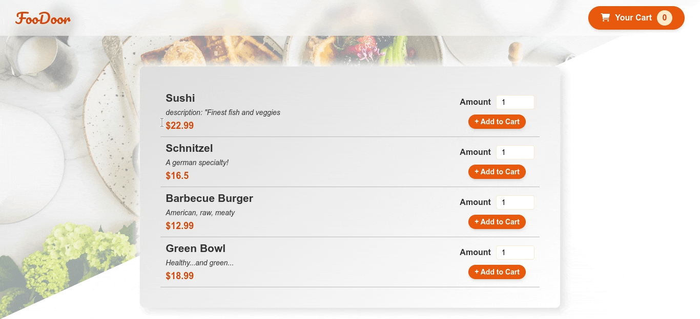
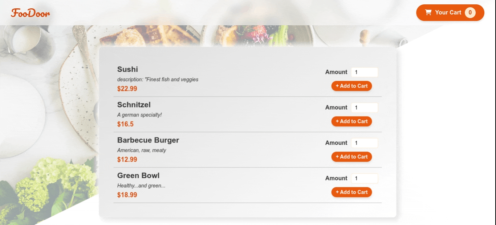

## FOOD ORDER APP

This project is a simple food ordering application from the available meals using React.JS. It includes complete cart functionality. Firebase realtime database is used for managing data. App wide state is managed using context api.

## Demo

